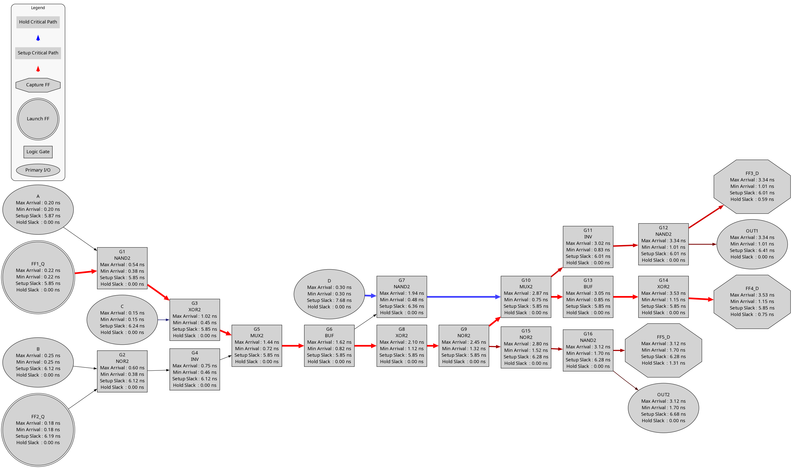

# Mini Static Timing Analysis Engine

A graph-based **Static Timing Analysis (STA)** engine written in **C++17** that performs setup and hold timing analysis on gate-level digital circuits.

The engine constructs a timing graph from a gate-level netlist, propagates arrival and required times, computes setup and hold slacks, extracts the worst critical paths, and generates Graphviz visualizations highlighting timing-critical paths.

---

## Features

- Graph-based timing analysis
- Setup timing analysis
- Hold timing analysis
- Maximum and minimum arrival time propagation
- Required arrival time computation
- Setup and hold slack calculation
- Cell delay and interconnect delay modeling
- Cell library parser
- Gate-level netlist parser
- Clock period and clock uncertainty support
- Input and output delay support
- Top-N setup and hold critical path reporting
- Graphviz timing graph visualization with highlighted critical paths

---

## Timing Analysis Flow

```text
                Cell Library
                     │
                     ▼
            +-----------------+
            | Library Parser  |
            +-----------------+
                     │
                     ▼

             Gate-Level Netlist
                     │
                     ▼
            +-----------------+
            | Netlist Parser  |
            +-----------------+
                     │
                     ▼
            +-----------------+
            |  Timing Graph   |
            +-----------------+
                     │
                     ▼
            +-----------------+
            |   STA Engine    |
            +-----------------+
              │             │
              │             │
              ▼             ▼
      Timing Reports   Graphviz Export
```

---

## Algorithms Implemented

### Graph Algorithms

- Directed timing graph construction
- Topological sorting using **Kahn's Algorithm**
- Critical predecessor tracking
- Critical path reconstruction

### Setup Analysis

- Maximum arrival time propagation
- Required arrival time propagation
- Setup slack computation
- Worst setup path extraction

### Hold Analysis

- Minimum arrival time propagation
- Hold slack computation
- Worst hold path extraction

---

## Supported Input

### Cell Library

Each cell entry specifies its maximum and minimum propagation delay.

```text
INV    0.15    0.08
BUF    0.18    0.10
NAND2  0.32    0.18
NOR2   0.35    0.20
MUX2   0.42    0.27
```

### Netlist

Supports

- Primary Inputs
- Primary Outputs
- Flip-Flops
- Logic Gates
- Cell Types
- Clock Period
- Clock Uncertainty
- Clock-to-Q Delay
- Setup/Hold Constraints
- Input Delay
- Output Delay
- Interconnect Edges

Example:

```text
CLOCK_PERIOD 10.0
CLOCK_UNCERTAINTY 0.30

NODE FF1_Q FF_Q
NODE G1 GATE NAND2
EDGE FF1_Q G1
```

---

## Example Timing Graph

<p align="center">

</p>

The generated visualization displays

- Primary Inputs / Outputs
- Launch Flip-Flops
- Capture Flip-Flops
- Logic Gates
- Arrival Times
- Setup Slack
- Hold Slack
- Setup Critical Paths (Red)
- Hold Critical Paths (Blue)

---

## Example Timing Report

```text
######################################################################
SETUP CRITICAL PATH REPORT
######################################################################

Path 1

Slack    : 5.85 ns
Endpoint : FF4_D

FF1_Q
 -> G1
 -> G3
 -> G5
 -> G6
 -> G8
 -> G9
 -> G10
 -> G13
 -> G14
 -> FF4_D
```

---

## Building

Compile the project using Make.

```bash
make
```

---

## Running

```bash
make run
```

or

```bash
./sta
```

---

## Project Structure

```text
.
├── Cell.cpp
├── Cell.hpp
├── DotExporter.cpp
├── DotExporter.hpp
├── LibraryParser.cpp
├── LibraryParser.hpp
├── NetlistParser.cpp
├── NetlistParser.hpp
├── Node.hpp
├── STAEngine.cpp
├── STAEngine.hpp
├── TimingGraph.cpp
├── TimingGraph.hpp
├── main.cpp
├── Makefile
└── README.md
```

---

## Future Work

- SDC parser
- Liberty (.lib) parser
- Multi-clock timing analysis
- False path support
- Multi-cycle path constraints
- Slew propagation
- Load propagation
- Incremental STA
- Parallel timing analysis
